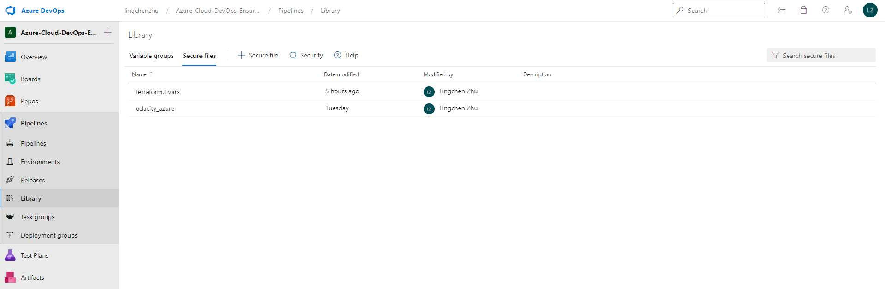
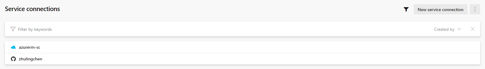
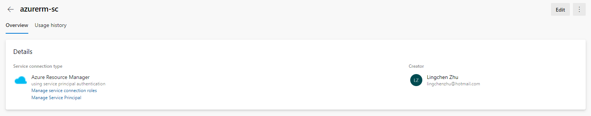
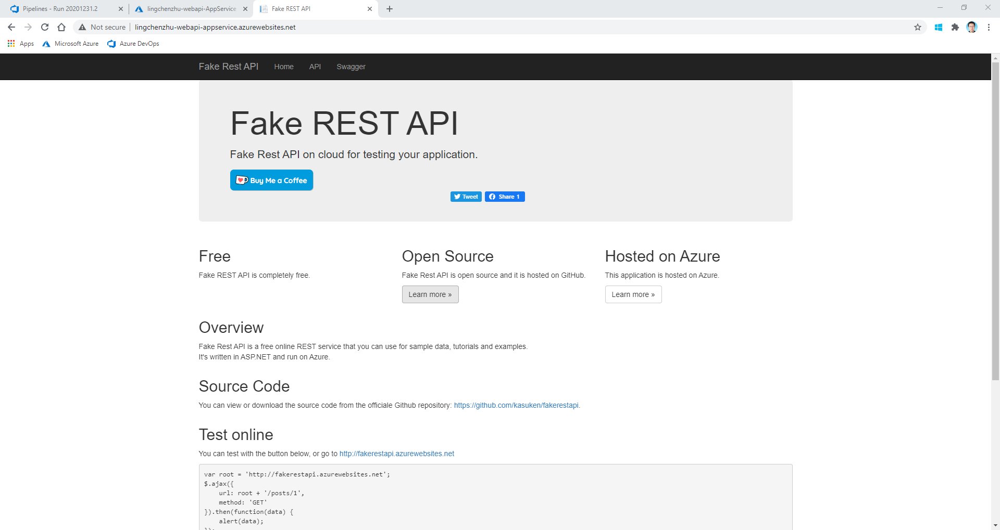

[](https://dev.azure.com/lingchenzhu/Azure-Cloud-DevOps-Ensuring-Quality-Releases/_build/latest?definitionId=3&branchName=main)

# Udacity DevOps Engineer for Microsoft Azure Nanodegree Program <br/> Project: Ensuring Quality Releases

## Instructions

1. Create a Service Principal for Terraform named `TerraformSP` by: `az ad sp create-for-rbac --role="Contributor" --name="TerraformSP"`, and such command outputs 5 values: `appId`, `displayName`, `name`, `password`, and `tenant`.

   Insert these information to [terraform/environments/test/main.tf](terraform/environments/test/main.tf), where `client_id` and `client_secret` are `appId` and `password`, respectively, as well as `tenant_id` is Azure Tenant ID and `subscription_id` is the Azure Subscription ID and both can be retrieved from the command `az account show` (`subscription_id` is the `id` key of `az account show`).

   ```
   provider "azurerm" {
     tenant_id       = "${var.tenant_id}"
     subscription_id = "${var.subscription_id}"
     client_id       = "${var.client_id}"
     client_secret   = "${var.client_secret}"
     features {}
   }
   ```

   Since it is not a good practice to expose these sensitive Azure account information to the public github repo, we define them in the terraform variable definition file [terraform/environments/test/terraform.tfvars](terraform/environments/test/terraform.tfvars) and avoid tracking such file to the repo. Instead, we upload such file to Pipelines >> Library >> Secure files and download it in the Azure Pipelines YAML config file [azure-pipelines.yml](azure-pipelines.yml) with a DownloadSecureFile@1 task.

   

2. [Configure the storage account and state backend](https://docs.microsoft.com/en-us/azure/developer/terraform/store-state-in-azure-storage).

    Replace the values below in [terraform/environments/test/main.tf](terraform/environments/test/main.tf) with the output from the Azure CLI in a block as

    ```
    terraform {
        backend "azurerm" {
            resource_group_name  = "${var.resource_group}"
            storage_account_name = "tstate12785"
            container_name       = "tstate"
            key                  = "terraform.tfstate"
        }
    }
    ```

3. Fill in the correct information in [terraform/environments/test/main.tf](terraform/environments/test/main.tf) and the corresponding modules.

4. [Install Terraform Azure Pipelines Extension by Microsoft DevLabs](https://marketplace.visualstudio.com/items?itemName=ms-devlabs.custom-terraform-tasks)

5. Create a new Service Connection by Project Settings >> Service connections >> New service connection >> Azure Resource Manager >> Next >> Service Principal (Automatic) >> Next >> Choose the correct subscription, and name such new service connection to Azure Resource Manager as `azurerm-sc`. This name will be used in [azure-pipelines.yml](azure-pipelines.yml).





6. Add TerraformTaskV1@0 tasks to perform `terraform init` and `terraform apply` in [azure-pipelines.yml](azure-pipelines.yml) to let them run in the Azure Pipelines build agent as if running in the local computer.

7. Build FakeRestAPI artifact by archiving the entire fakerestapi directory into a zip file and publishing the pipeline artifact to the artifact staging directory.

8. Deploy FakeRestAPI artifact to the terraform deployed Azure App Service. The deployed webapp URL is [http://lingchenzhu-webapi-appservice.azurewebsites.net/](http://lingchenzhu-webapi-appservice.azurewebsites.net/) where `lingchenzhu-webapi-appservice` is the Azure App Service resource name in small letters.

